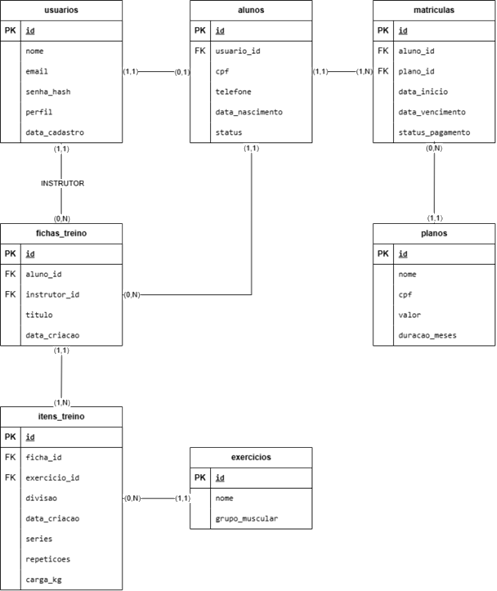
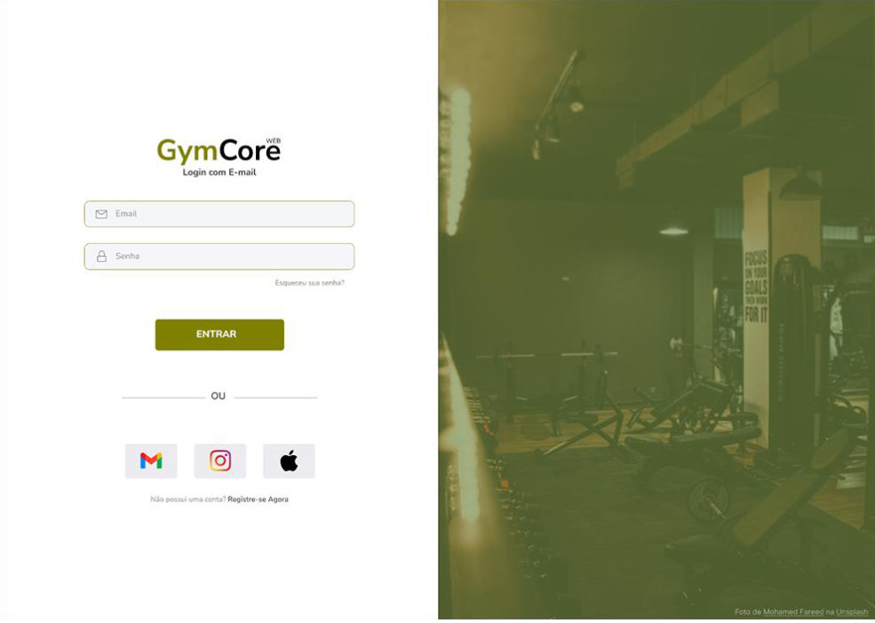
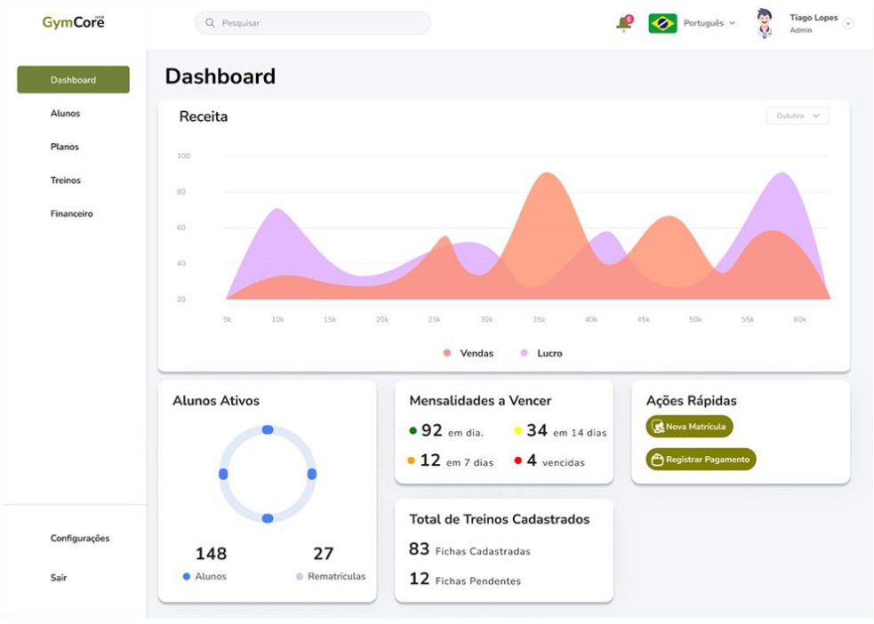
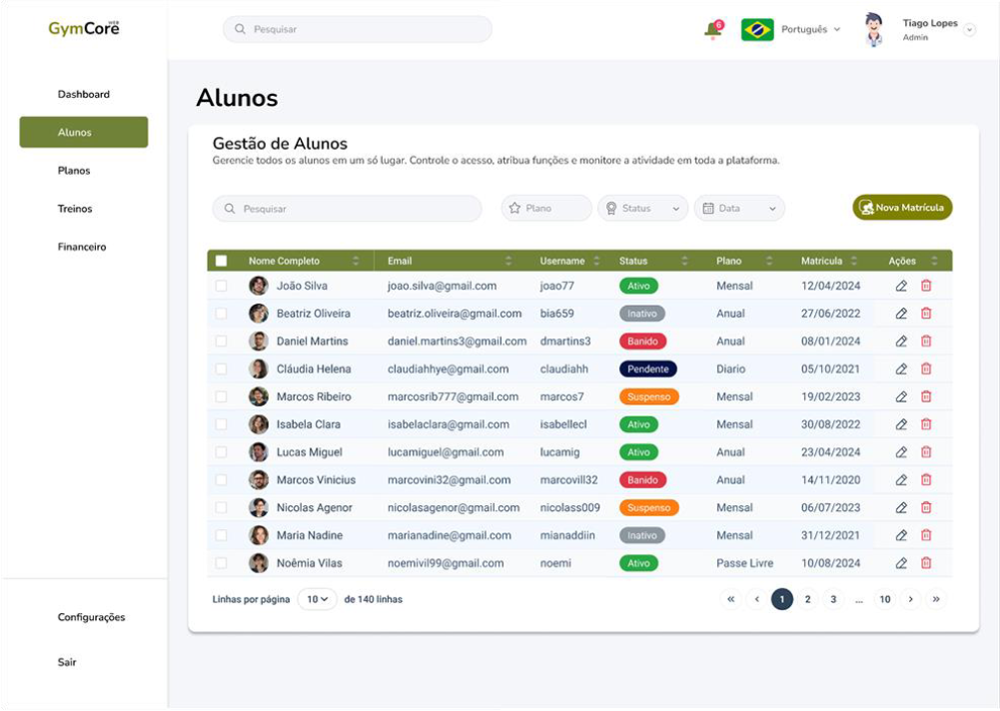
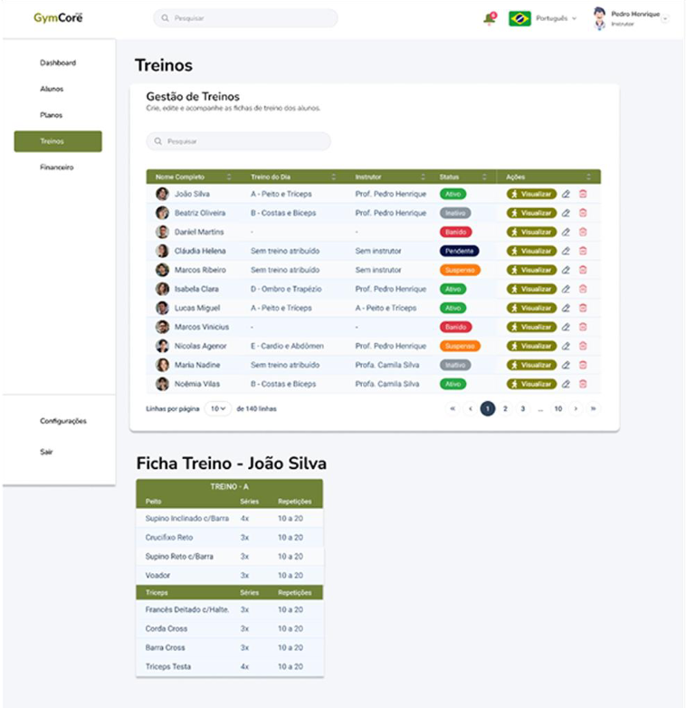

## CURSO DE TECNÓLOGO EM ANÁLISE E DESENVOLVIMENTO DE SISTEMAS

## TIAGO LOPES DE ANDRADE ITALO LOPES DE ANDRADE

## GYMCORE WEB: SISTEMA WEB DE GESTÃO DE ACADEMIA

## JUAZEIRO - BA 2026

## TIAGO LOPES DE ANDRADE ITALO LOPES DE ANDRADE

## GYMCORE WEB: SISTEMA WEB DE GESTÃO DE ACADEMIA

Projeto de sistema apresentado à disciplina de Projeto e Implementação de Sistemas para Web 2 do Curso de Tecnólogo em Análise e Desenvolvimento de Sistemas da Universidade Federal do Vale do São Francisco (UNIVASF),

como requisito parcial de avaliação

## JUAZEIRO - BA 2026

## SUMÁRIO

## 1. DESCRIÇÃO DO PROJETO

O GymCore Web é uma aplicação web voltada para a automação e centralização da

gestão operacional, financeira e instrutiva de academias de ginástica e centros de treinamento.

O sistema resolverá o problema da dispersão de informações (muitas vezes mantidas em

planilhas ou fichas de papel), permitindo o controle digital de matrículas, gestão de planos e

mensalidades, além da montagem de fichas de treinos personalizadas para cada aluno.

A arquitetura do sistema utilizará o padrão MVC/DAO em PHP 8, garantindo

persistência segura de dados com MySQL e PDO (Prepared Statements) contra ataques como

SQL Injection, e uma interface responsiva baseada em HTML5, CSS3 e Javascript.

## 2. OBJETIVOS E PÚBLICO-ALVO

## 2.1 Objetivo Geral

Desenvolver e implementar uma plataforma web completa para a gestão integrada de

academias de ginástica, apta a centralizar o controle de alunos, o gerenciamento financeiro de

planos/mensalidades e a prescrição digital personalizada de treinos físicos com alta segurança,

desempenho e usabilidade.

## 2.2 Objetivos Específicos

- Implementar controle de acesso baseado em níveis de usuário (Administrador, Instrutor/Personal, Aluno);

- Desenvolver o módulo de cadastro e manutenção de alunos e seus respectivos status de adimplência;

- Criar a funcionalidade de prescrição de treinos digitais (fichas com séries, repetições e exercícios)

- Automatizar a gestão de planos (Mensal, Trimestral, Anual) e acompanhamento de vencimentos;

- Aplicar padrões modernos de desenvolvimento Web (POO, arquitetura DAO e segurança com PDO).

## 2.3 Público-Alvo

Administradores / Recepcionistas: Responsáveis por matricular alunos, receber

pagamentos, alterar planos e acompanhar métricas da academia. Desenvolver o módulo de cadastro e manutenção de alunos e seus respectivos status de adimplência;

Instrutores / Personal Trainers: Responsáveis pela criação, montagem e atualização das

fichas de treinos dos alunos.

Alunos: Usuários finais que acessam o sistema para visualizar seus treinos ativos,

histórico de treinos e status da assinatura.

## 3. FUNCIONALIDADES PREVISTAS

## 3.1. Autenticação e Controle de Acesso

- Login seguro com verificação de perfil (Admin, Instrutor, Aluno);

- Criptografia de senhas (usando password_hash do PHP);

- Encerramento seguro de sessão (Logout).

## 3.2.Gestão de Alunos e Usuários

- CRUD (Criar, Ler, Atualizar, Deletar) de Usuários do sistema;

- Cadastro completo de Aluno (Dados pessoais, CPF, telefone, data de nascimento, foto);

- Alteração de status do aluno (Ativo, Inativo, Pendente)

## 3.3. Planos e Financeiro

- Cadastro de Planos (Ex: Plano Mensal R\$ 100, Plano Anual R\$ 80/mês);

- Vinculação de Aluno a um Plano (Geração da Matrícula);

- Registro e controle de pagamentos / data de vencimento.

## 3.4. Prescrição e Gestão de Treinos

- Cadastro de catálogo de Exercícios (Ex: Supino Reto, Agachamento, Puxada Alta) categorizados por grupo muscular;

- Criação de Fichas de Treino vinculadas a um Aluno e criadas por um Instrutor;

- Definição de Séries, Carga (kg), Repetições e Dias da Semana (Treino A, B, C).

## 3.5. Dashboard e Relatórios

- Painel administrativo com total de alunos ativos, mensalidades a vencer no mês e treinos cadastrados;

- Painel do Aluno para consulta ágil do treino do dia via celular.

## 4. ESTRUTURA DER (DIAGRAMA DE ENTIDADE-RELACIONAMENTO)

O Diagrama de Entidade-Relacionamento (DER) é o modelo conceitual e lógico

responsável por mapear o esquema do banco de dados relacional. Ele define visualmente as

entidades do domínio, seus atributos fundamentais e a cardinalidade dos relacionamentos

existentes no sistema.

No GymCore Web, o DER é estruturado para garantir a integridade referencial dos

dados operacionais e financeiros. As entidades principais incluem: usuario (armazena as

credenciais e o perfil de acesso), aluno (contém os dados específicos do cliente), plano (define

os tipos de assinaturas disponíveis), matricula (associa o aluno ao seu plano vigente e controla

os vencimentos), exercicio (catálogo de movimentos físicos) e treino / item_treino (estruturam

as fichas de treino personalizadas associando instrutor, aluno e exercícios).

*Figura 1 – Diagrama de Entidade-Relacionamento (DER) do banco de dados GymCore Web.*

## 5. PROTÓTIPOS DAS TELAS (WIREFRAMES)

Com o objetivo de validar a navegação, a arquitetura de informação e a experiência do

usuário (UX), foram desenvolvidos os protótipos de interface do sistema GymCore Web na

ferramenta Figma. Os wireframes contemplam os fluxos principais da aplicação, incluindo a

dashboard administrativa, o controle financeiro, a gestão de matrículas e o módulo de prescrição

e consulta de treinos digitais.

O protótipo interativo completo pode ser visualizado e navegado através do link abaixo:

[https://www.figma.com/proto/r65sNCO9jRebceJl64wjo4/GymCore?node-id=3-](https://www.figma.com/proto/r65sNCO9jRebceJl64wjo4/GymCore?node-id=3-73&t=e3iu4t7Zci1Wk2Uz-1&scaling=min-zoom&content-scaling=fixed&page-id=0%3A1)

[73&t=e3iu4t7Zci1Wk2Uz-1&scaling=min-zoom&content-scaling=fixed&page-id=0%3A1](https://www.figma.com/proto/r65sNCO9jRebceJl64wjo4/GymCore?node-id=3-73&t=e3iu4t7Zci1Wk2Uz-1&scaling=min-zoom&content-scaling=fixed&page-id=0%3A1)

- 6. REPOSITÓRIO GITHUB

Link do Repositório (Tiago Lopes)

- [https://github.com/tiagolopes-ads/GymCore-Web-.git](https://github.com/tiagolopes-ads/GymCore-Web-.git)

Link do Repositório (Ítalo Lopes)

- [https://github.com/italolopesandrade/GymCore-Web](https://github.com/italolopesandrade/GymCore-Web)
